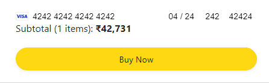

# Amazon Clone in React

- Login & Register feature
- Shopping Cart functionality
- Integrated Stripe for Payments
- Full E-Commerce Functionality
- Spam "4 & 2" in the card details to complete the order.

---

[Click Here](https://amazon-clone-harshcodes.netlify.app/)

---

## What did I learn from this Project?

- React

- React Router Dom

- React Components

- React Props

- Firebase

- Firebase Authentication

- Firebase Functions

- Mobile Responsiveness

- Express

- React Bootstrap

- Axios

---

## How much did it take to build this Project?

- It took me around a week to make this project.

---

## **About me**

#### **Hey, I'm Harsh Thakkar**

- I'm 23 and I live in Thane, Maharashtra. I'm pursuing Full Stack Web Development.

---

## **Feedback**

- Feedbacks are always appreciated. harsh.thakkar1011@gmail.com
